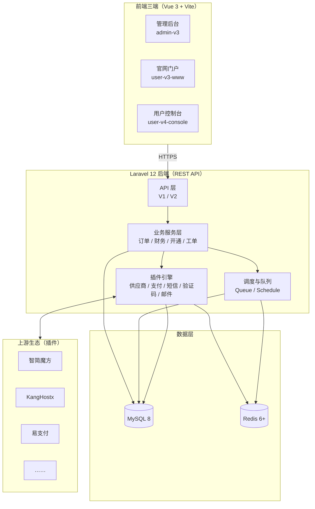
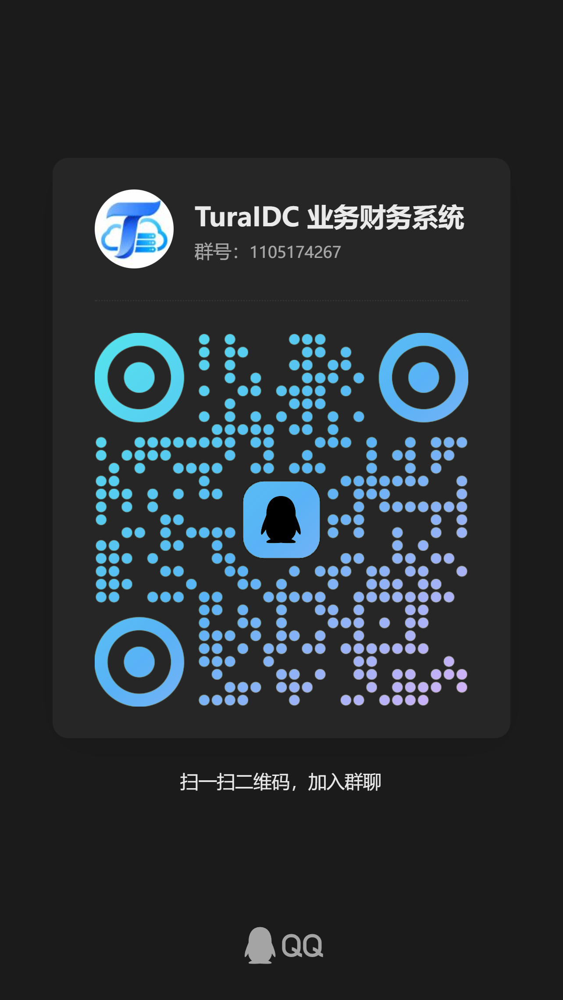

<p align="center">
  
</p>

<h1 align="center">图拉云 TuraIDC 业务/财务系统</h1>

<p align="center">
  <strong>新一代 IDC / 云服务经营系统</strong> · 商品 · 订单 · 计费 · 自动开通 · 财务 · 工单 · 分销 全业务闭环
</p>

<p align="center">
  <a href="https://github.com/25Cloud/TuraIDC/releases"></a>
  <a href="https://github.com/25Cloud/TuraIDC/stargazers"></a>
  <a href="https://github.com/25Cloud/TuraIDC/network"></a>
  <a href="https://github.com/25Cloud/TuraIDC/graphs/contributors"></a>
  <a href="https://github.com/25Cloud/TuraIDC/issues"></a>
  <a href="https://github.com/25Cloud/TuraIDC/actions/workflows/ci.yml"></a>
  <br>
  <a href="./LICENSE"></a>
  
  
  
  <a href="https://github.com/25Cloud/TuraIDC/commits/main"></a>
</p>

<p align="center">
  <b>English</b> · <a href="docs/README.md">文档</a> · <a href="docs/DESIGN.md">设计</a> · <a href="docs/ARCHITECTURE.md">架构</a>
</p>

---

面向 IDC / 云服务商的业务与财务经营系统。覆盖商品管理、订单计费、自动开通、发票、充值、分销返佣、工单、通知等完整业务闭环，提供管理后台、官网门户与用户控制台三端前端，并通过可扩展插件机制对接上游供应商与第三方服务。

## ✨ 核心能力

| 领域          | 能力                                                                   |
| ------------- | ---------------------------------------------------------------------- |
| 🛒 商品与计费 | 产品分组、产品配置项、多计费周期（月付/季付/年付）、自动续费、库存管理 |
| 📦 订单与开通 | 下单、支付回调、自动开通（对接上游供应商）、失败重试、自动挂起/释放    |
| 💰 财务       | 余额账户、充值、发票、退款、对账、账务流水与明细                       |
| 👤 用户体系   | 注册登录、实名认证（可选）、会员等级、分销与返佣、推广提现             |
| 🎫 工单系统   | 部门分配、工单回复、超时自动关闭                                       |
| 🔔 通知       | 站内信、邮件、短信（模板可配置）                                       |
| ⚙️ 自动化     | 调度任务、心跳监控、定时对账、日志归档                                 |
| 🔌 插件机制   | 供应商适配、支付网关、短信、验证码、邮件均以插件形式接入               |

## 🔗 智简魔方财务（ZJMF Finance）双向兼容

- **对接智简魔方财务系统**：作为上游供应商接入，商品目录、库存、开通、续费、网络/安全操作等通过官方 API 完整适配。
- **支持被智简魔方财务系统原生对接（实验）**：通过内置 ZJMF Bridge 插件，为存量智简魔方财务系统提供兼容 API 与签名校验，让旧生态无缝迁移，降低替换成本。
- **从智简魔方财务系统迁移**：老站业务数据（产品/用户/订单/上游/实名）完整迁移教程见 [从智简魔方财务系统迁移](docs/references/database/migrate-from-zjmf-finance.md)。

## ❌ 我们没有

部分同类商业系统的常见问题，在本项目中刻意避免：

- **没有零元购金额篡改漏洞**：订单、续费金额一律由服务端按规则重算，客户端参数（如计费乘数）无法将应付金额改为零或负值。
- **没有对接上游不鉴权漏洞**：上游凭据仅由服务端持有，客户端与匿名请求无法获得原始上游令牌（JWT），所有上游调用经过鉴权与代理。
- **没有文件任意上传**：上传接口强制认证，并校验类型、大小与配额，拒绝匿名大文件上传与内存放大。
- **没有收费授权也没有后门**：完整开源（AGPL-3.0），无授权系统、无隐藏远程控制，代码可审计、可自行部署。
- **没有跨租户越权**：资源查询与操作一律绑定当前用户所有权，越权访问统一返回 403/404。
- **没有支付回调重放**：网关回调幂等 + 交易号唯一约束，同一笔交易只入账、只履约一次。
- **没有常见注入与伪造**：SQL 参数化查询、不可信代理头不参与 IP 判定、Cookie 带安全属性并启用 CSRF 防护。

## ✅ 我们有

- **服务端权威计算**：金额、库存、优惠券、续费全部服务端重算并加锁，防止并发与篡改。
- **完整审计日志**：关键资金、订单、后台操作留痕，支持导出与归档。
- **登录风控**：账号 + IP 级软锁定、验证码目标维度限流、多入口统一校验。
- **插件化架构**：供应商、支付、短信、验证码、实名、邮件均以插件接入，边界清晰、可替换。
- **自动化兜底**：调度任务、心跳监控、定时对账、失败重试与自动挂起/释放。
- **开源可审计**：AGPL-3.0-or-later 许可，无授权收费，社区可自行审查、修复与二次开发。

## 🏗️ 架构总览



## 🧩 技术栈

| 端         | 技术                                                                 |
| ---------- | -------------------------------------------------------------------- |
| 后端       | Laravel 12（PHP 8.3+）、Sanctum、MySQL 8.0+（最低兼容 5.7.8）、Redis |
| 管理后台   | Vue 3 + TypeScript + TDesign Vue Next + Vite                         |
| 官网门户   | Vue 3 + JavaScript + Element Plus + Vite                             |
| 用户控制台 | Vue 3 + TypeScript + TDesign Vue Next + Vite                         |
| 共享包     | shared（跨端会话、HTTP、状态、组件）                                 |

## 🤝 生态与合作伙伴

系统通过插件机制对接的成熟服务商生态：

| 类别       | 已适配                                         |
| ---------- | ---------------------------------------------- |
| 上游供应商 | 智简魔方财务（ZJMF）、KangHostx                |
| 支付网关   | 支付宝（AliPay）、易支付（EPay）               |
| 短信服务   | 阿里云短信（Aliyun）、Stay33                   |
| 验证码     | 极验（Geetest）、Vaptcha、Corptcha             |
| 实名认证   | 百度人脸（BaiduFace）、LeafFace、Smapi、Stay33 |
| 邮件       | SMTP、多 SMTP 轮询（MultiSmtpRoundRobin）      |
| 桥接扩展   | ZJMF Bridge（存量智简魔方数据兼容）            |

## 🤝 Trusted Partners

<p align="center">
  <em>No particular order</em>
</p>

<p align="center">
  <a href="https://www.7inet.moe/" target="_blank">
    
  </a><!--
  --><a href="https://www.starvm.cn/" target="_blank">
    
  </a><!--
  --><a href="https://idc.25y.cn/" target="_blank">
    
  </a><!--
  --><a href="https://www.idcxl.cn/" target="_blank">
    
  </a>
</p>

## 💬 开发交流

欢迎加入 TuraIDC 开发交流 QQ 群 **1105174267**，讨论产品、架构、插件开发与部署运维。

<p align="center">
  <a href="https://qm.qq.com/q/Doa31p5M30" target="_blank">点击链接加入群聊【TuraIDC 业务财务系统】</a>
  <br>
  
</p>

## 🗺️ Roadmap

当前版本进行中的工作（详见 `docs/execution-plans/active/`）：

- 后端专家团审查修复计划（认证、财务、并发安全域）收尾
- 定时任务体系重构方案
- 日志归档系统可靠性重构方案
- 数据库专家团审查修复计划
- 调度 VNC 上游开通续费插件审查修复
- 报表中心方案
- 日志检索与归档协同
- 短信验证码链路完善
- 告警通道接入（待产品/运维确认渠道）

## 📊 项目热度

<a href="https://www.star-history.com/?repos=25Cloud%2FTuraIDC&type=date&legend=top-left">
  <picture>
    <source media="(prefers-color-scheme: dark)" srcset="https://api.star-history.com/chart?repos=25Cloud/TuraIDC&type=date&theme=dark&legend=top-left&sealed_token=DLZeeKcw05mIrh2HqJHHcah_CJlwXqq0_AW-LpSPtWsFoVE6Px46XG3BoaMrvOmP-N-Pcp22-B-fQna7PXyJum3iYhdzpsJD0xsfA7tCvxXDdFS3-MSOeg" />
    <source media="(prefers-color-scheme: light)" srcset="https://api.star-history.com/chart?repos=25Cloud/TuraIDC&type=date&legend=top-left&sealed_token=DLZeeKcw05mIrh2HqJHHcah_CJlwXqq0_AW-LpSPtWsFoVE6Px46XG3BoaMrvOmP-N-Pcp22-B-fQna7PXyJum3iYhdzpsJD0xsfA7tCvxXDdFS3-MSOeg" />
    
  </picture>
</a>

## 🧑‍💻 贡献者

[](https://github.com/25Cloud/TuraIDC/graphs/contributors)

## 📁 目录结构

```
TuraIDC/
├── backend/                  # Laravel 后端
│   ├── app/                  # 业务代码（模型/服务/命令/中间件）
│   ├── config/               # 配置（含可选集成占位）
│   ├── database/
│   │   ├── schema/           # 完整结构基线 mysql-schema.sql（新环境初始化）
│   │   ├── migrations/       # 增量迁移
│   │   └── seeders/          # 系统默认配置
│   ├── plugins/              # 插件（供应商/支付/短信/验证码/邮件）
│   ├── routes/               # api.php / v2-admin.php / v2-client.php / web.php
│   └── scripts/              # 构建与运维脚本
├── frontend-admin-v3/        # 管理后台（端口 5174）
├── frontend-user-v3-www/     # 官网门户（端口 5175）
├── frontend-user-v4-console/ # 用户控制台（端口 5173）
└── shared/                   # 跨前端共享包
```

## 🔧 环境要求

- PHP 8.3+（扩展：`pdo_mysql`、`redis`、`mbstring`、`openssl`、`zip` 等）
- MySQL 8.0+（推荐；最低兼容 5.7.8，5.7 已 EOL 仅兼容性支持；5.7 部署需在 my.cnf 设置 `explicit_defaults_for_timestamp=ON`，详见 docs/references/operations/deployment.md）
- Redis 6.0+（生产环境必需，分布式锁依赖 Redis）
- Composer 2.x
- Node.js 20+（构建前端）

## 🧭 从智简魔方财务系统迁移

正在使用智简魔方财务（ZJMF，`shd_` 前缀）并想切换到 TuraIDC？支持将老站业务数据一键迁移：

- **产品 / 用户 / 订单 / 账单 / 工单 / 服务** 全量迁移（从 `mysqldump` 流式解析，无需源库在线）
- **上游供应商** 自动同步并解密 API 密钥，恢复实时开通 / 续费 / 控制能力
- **实名认证、商品配置项、OS 系统选择** 等细节数据完整落地
- 老用户密码 `###md5` 无缝兼容，登录后自动升级

> 📖 完整分步教程（含生产踩坑记录）：[从智简魔方财务系统迁移](docs/references/database/migrate-from-zjmf-finance.md)

```bash
# 示例：迁移主流程（预检 → 重建分组 → 迁移数据 → 预热缓存）
python3 backend/scripts/mofang_to_turaidc_migrator.py --dry-run
php artisan app:reorganize-product-groups
php artisan optimize:clear && php artisan app:warmup-site-cache
```

## 🚀 快速开始（开发环境）

### 1. 后端

```bash
cd backend
cp .env.example .env
# 编辑 .env：DB_HOST / DB_PORT / DB_DATABASE / DB_USERNAME / DB_PASSWORD 等
composer install
php artisan key:generate

# 初始化数据库（新库）：先导入完整结构，再执行增量迁移
mysql -u root -p finance < database/schema/mysql-schema.sql
php artisan migrate --force

# 写入系统默认配置
php artisan db:seed --class=Database\\Seeders\\SettingsSeeder

# 创建管理员（role_id 需为超级管理员角色 id）
php artisan tinker
App\Models\AdminUser::create([
    'username' => 'admin',
    'password' => 'password',
    'role_id'  => 1,
    'nickname' => '管理员',
    'status'   => 1,
]);

# 启动开发服务（默认 127.0.0.1:8000）
php artisan serve
```

### 2. 前端

```bash
# 仓库根目录安装依赖（npm workspaces）
npm install

# 分别启动三端（开发端口：官网 5175 / 控制台 5173 / 管理端 5174）
npm run dev:user-v3-www
npm run dev:user-v4-console
npm run dev:admin-v3
```

### 3. 后台进程

生产环境需常驻两个进程（详见 [部署指南](./docs/references/operations/deployment.md)）：

```bash
php artisan queue:work --queue=provision,referral,notification,coupon,default --sleep=1 --tries=3 --timeout=1200
php artisan schedule:work
```

## 🐳 快速开始（Docker 部署）

`docker compose` 一键拉起 MySQL 8 + Redis 7 + 后端（PHP-FPM / Nginx / Cron / VNC Relay）+ 前端三端合一，共 4 个容器。详细说明见 [Docker 与 1Panel 部署指南](docs/references/operations/docker-and-1panel-deployment.md)。

### 1. 配置 CI Secrets（自动构建镜像）

CI（`.github/workflows/docker-image.yml`）在推送到 `main`、打 tag 或手动触发时，自动构建 2 个镜像推送到 GHCR（`GITHUB_TOKEN` 由 GitHub 自动注入，无需配置）。进入仓库 **Settings → Secrets and variables → Actions**，在 **Variables** 标签页（推荐，明文非敏感）或 Secrets 中添加：

| 变量                           | 必填 | 说明                                     | 示例                          |
| ------------------------------ | ---- | ---------------------------------------- | ----------------------------- |
| `APP_URL`                      | 是   | API 公开地址                             | `https://api.example.com`     |
| `FRONTEND_URL`                 | 是   | 官网地址                                 | `https://www.example.com`     |
| `CLIENT_CONSOLE_URL`           | 是   | 用户控制台地址                           | `https://console.example.com` |
| `ADMIN_URL`                    | 是   | 管理端地址                               | `https://admin.example.com`   |
| `CLIENT_SESSION_COOKIE_DOMAIN` | 否   | 跨子域共享登录态时填父域，单域部署可不配 | `.example.com`                |

四个地址必须互不相同、同一协议、无路径。未配置时前端构建会直接失败以提醒补全。

> 地址在构建时被 Vite 静态编译进前端产物，无法运行时注入，因此 CI 构建必须在 GitHub 侧配置。不使用 CI 时可走本地构建（`docker compose up -d --build`），地址直接读 `deploy/docker/.env`，GitHub 侧零配置。

### 2. 服务器上启动

```bash
cd deploy/docker
cp .env.example .env
# 编辑 .env：数据库密码、INSTALL_ADMIN_PASSWORD、对外端口等

docker compose pull && docker compose up -d   # 拉取 CI 镜像（推荐）
# 或 docker compose up -d --build             # 本地构建（全部）
```

### 2b. 混合模式（后端拉镜像 + 前端本地构建）

不想在 CI 配域名 Variables、但也不想本地 build 后端？可以只 build 前端，后端照常 pull：

```bash
git clone https://github.com/<owner>/TuraIDC.git   # 服务器上拉源码（前端构建需要）
cd TuraIDC/deploy/docker
cp .env.example .env
# 编辑 .env：域名、数据库密码、INSTALL_ADMIN_PASSWORD 等

docker compose pull app              # 只拉后端镜像（CI 构建，不含域名）
docker compose build frontends       # 只构建前端（域名从 .env 读，CI 零配置）
docker compose up -d                 # 启动全部
```

前端地址直接读 `deploy/docker/.env`，改域名后重新 `build frontends && up -d` 即可，不用碰 GitHub。

升级同理：

```bash
git pull                            # 拉最新源码（前端要这个）
docker compose pull app             # 拉最新后端镜像
docker compose build frontends      # 重新构建前端
docker compose up -d
```

> 后端不受前端域名影响——`APP_URL` 等通过 `env_file: .env` 在容器启动时注入，是运行时配置，改 `.env` 重启就生效，不需要重新构建镜像。

首次启动（空库）自动初始化数据库并创建管理员 `cerbo`（密码为 `.env` 中 `INSTALL_ADMIN_PASSWORD`，仅首次生效）。默认端口：API `8080` / 官网 `8081` / 控制台 `8082` / 管理端 `8083`。

### 3. 常用命令

```bash
docker compose ps                          # 容器状态（应全部 healthy）
docker compose logs -f app                 # 跟踪后端日志
curl http://127.0.0.1:8080/api/ready       # 就绪检查（DB/Cache/Storage/Scheduler）
docker compose pull && docker compose up -d   # 升级到新镜像
./backup.sh                                # 备份数据库
```

## 🏗️ 构建前端产物

`npm run build:frontends` 会读取 `backend/.env` 中的 `APP_URL` / `FRONTEND_URL` / `CLIENT_CONSOLE_URL` / `ADMIN_URL`（四个地址必须互不相同且协议一致），依次构建三端并输出到各自 `dist/`。

## 📚 文档

- [文档官网维护指南](docs/governance/docs-web-maintenance.md)
- [部署指南](./docs/references/operations/deployment.md)
- [贡献指南](./.github/CONTRIBUTING.md)
- [安全政策](./.github/SECURITY.md)
- [行为准则](./.github/CODE_OF_CONDUCT.md)
- [变更记录](./docs/CHANGELOG.md)

## 📄 开源许可

本项目采用 [GNU Affero General Public License v3.0 或更高版本（AGPL-3.0-or-later）](./LICENSE) 开源。

> 说明：本项目管理后台与控制台基于 [TDesign Vue Next Starter](https://github.com/Tencent/tdesign-vue-next-starter) 构建；TuraIDC 自有代码采用 AGPL-3.0-or-later，TDesign 原始代码及其许可声明继续采用 MIT，详见各子目录的 `LICENSE`。
